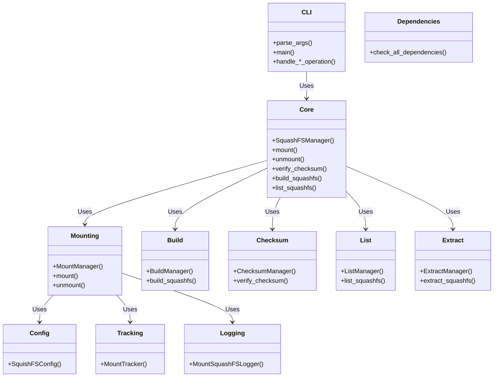
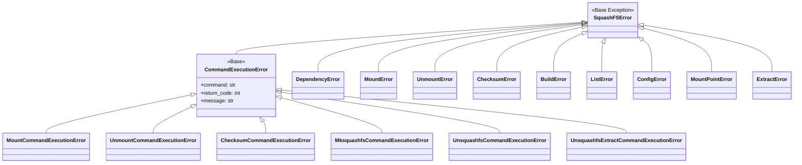
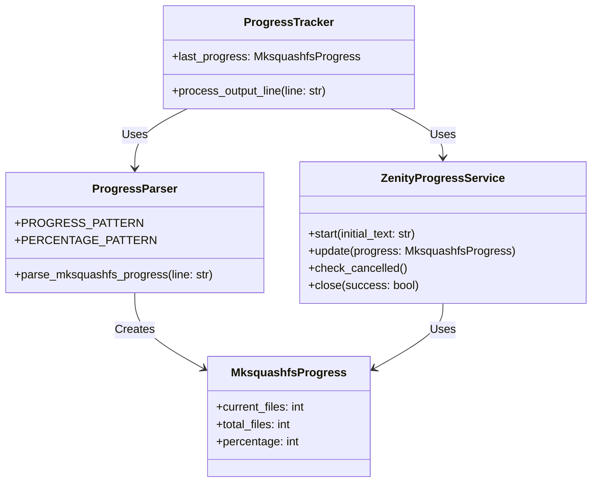

# Design Documentation

This document provides a concise overview of the squish project's architecture and key features.

## Project Overview

**squish** is a Python-based utility for comprehensive management of SquashFS filesystems, providing:

- Mounting and unmounting SquashFS archives
- Building SquashFS archives from source directories
- Listing contents of SquashFS archives
- Checksum verification for data integrity

## Architecture

The project follows a modular architecture with clear separation of concerns:

### Core Components



### Module Structure

- **`entry.py`**: Main entry point (not tested - zipapp bundling only)
- **`squashfs-actions.desktop`**: Desktop integration file
- **`squish/cli.py`**: Command-line interface and argument parsing
- **`squish/core.py`**: Main facade coordinating all operations
- **`squish/mounting.py`**: Mount/unmount functionality with tracking
- **`squish/build.py`**: SquashFS archive creation with progress tracking
- **`squish/checksum.py`**: SHA256 checksum verification
- **`squish/list.py`**: Archive content listing
- **`squish/config.py`**: Configuration management
- **`squish/tracking.py`**: Mount state tracking
- **`squish/logging.py`**: Custom logging system
- **`squish/dependencies.py`**: System tool validation
- **`squish/errors.py`**: Comprehensive error hierarchy

## CLI Interface

### Commands

- **mount (m)**: `squish mount <file> [mount_point]` or `squish m <file> [mount_point]`
- **unmount (um)**: `squish unmount <file> [mount_point]` or `squish um <file> [mount_point]`
- **check (c)**: `squish check <file>` or `squish c <file>`
- **build (b)**: `squish build [options] <source> <output>` or `squish b [options] <source> <output>`
- **ls (l)**: `squish ls <archive>` or `squish l <archive>`
- **extract (ex)**: `squish extract <archive> [-o <output_dir>]` or `squish ex <archive> [-o <output_dir>]`

### Build Options

- `-e, --exclude`: Add exclude patterns
- `-f, --exclude-file`: Use file with exclude patterns
- `-w, --wildcards`: Enable wildcard matching
- `-r, --regex`: Enable regex matching
- `-c, --compression`: Compression algorithm (default: zstd)
- `-b, --block-size`: Block size (default: 1M)
- `-p, --processors`: Number of processors (default: auto)
- `-P, --progress`: Show progress dialog with Zenity (falls back to console if Zenity unavailable)

### Extract Options

- `-o, --output`: Output directory (default: current directory)

## Key Features

### Mount/Unmount

- **Automatic mount point determination**
- **Robust mount tracking** to prevent conflicts
- **Configurable auto-cleanup** of mount directories
- **Dependency validation** (squashfuse, fusermount)
- **Comprehensive safety checks**

### Build

- **Multiple compression algorithms** (zstd, gzip, xz, etc.)
- **Exclusion patterns** (patterns, wildcards, regex)
- **Parallel processing** with automatic processor detection
- **Automatic checksum generation** (SHA256)
- **Validation** to prevent overwriting existing files
- **Real-time progress tracking** with Zenity progress dialog (with console fallback)
- **Cancel button support** for interrupting build operations
- **Progress parsing** from mksquashfs output
- **Graceful fallback** to console progress when Zenity is unavailable

### Checksum Verification

- **SHA256 integrity checking**
- **Automatic checksum file detection**
- **File location validation**
- **Checksum file parsing**

### List

- **Archive content listing** without mounting
- **Detailed output** using unsquashfs
- **Dependency validation**

### Extract

- **Archive content extraction** to specified directories
- **Automatic output directory creation** if needed
- **Default extraction** to current directory
- **Dependency validation** for unsquashfs
- **Comprehensive error handling** for file operations

## Configuration

### Main Configuration Options

- `mount_base`: Base directory for automatic mount points
- `temp_dir`: Temporary directory for tracking files
- `auto_cleanup`: Enable automatic mount directory cleanup
- `verbose`: Enable detailed logging
- `compression`: Default compression algorithm
- `block_size`: Default block size
- `processors`: Default processor count

## Error Handling

### Error Hierarchy



### Key Error Types

- **DependencyError**: Missing system tools
- **MountError/UnmountError**: Mount operation failures
- **BuildError**: Archive creation failures
- **BuildCancelledError**: Build cancellation by user
- **ChecksumError**: Verification failures
- **ConfigError**: Invalid configuration
- **MountPointError**: Mount point validation issues
- **CommandExecutionError**: Command execution failures (with specific subclasses)
- **ExtractError**: Extraction operation failures

## Testing

### Test Architecture

- **Fixture-based approach** with test data builder (`SquashFSTestDataBuilder`)
- **Comprehensive coverage** (90%+ target) with branch coverage
- **Mocking strategy** for external dependencies using pytest-mock
- **Error path testing** for all operations
- **Parametrized testing** for comprehensive scenario coverage
- **Test markers** for categorization and selective execution

### Test Configuration

The test suite is configured in `pyproject.toml` with:

- **Python path**: `src` for proper module imports
- **Test paths**: `tests` directory
- **Default options**: `--cov=src/squish --cov-report=term-missing --cov-branch -xvs`
- **Coverage tracking**: Branch coverage enabled
- **Warning filtering**: Deprecation warnings ignored

### Key Test Components

#### Fixtures

- **`test_files`**: Basic test files (squashfs, checksum, source directory) - backward compatible
- **`build_test_files`**: Build-focused test files with nested directories
- **`checksum_test_files`**: Checksum verification test files
- **`test_data_builder`**: Custom test data creation using `SquashFSTestDataBuilder`
- **`test_config`**: Test configuration with isolated temp directory using pytest's `tmp_path`
- **`build_manager`**, `checksum_manager`, `mount_manager`, `list_manager`: Module-specific managers
- **`tracker`**: MountTracker instance for testing
- **`logger`**: MountSquashFSLogger instance for testing
- **`mock_manager`**: Mock manager for testing interactions

#### Enhanced Built-in Fixtures

- **`capsys_fixture`**: Enhanced stdout/stderr capture
- **`capfd_fixture`**: Enhanced binary stdout/stderr capture
- **`monkeypatch_fixture`**: Enhanced flexible patching
- **`tmp_path_factory_fixture`**: Enhanced session-scoped temp directory
- **`pytestconfig_fixture`**: Enhanced pytest configuration access
- **`cache_fixture`**: Enhanced caching functionality

#### Test Markers

The project uses pytest markers for test categorization (as defined in pyproject.toml):

- **`@pytest.mark.slow`**: Marks tests as slow (deselect with '-m not slow')
- **`@pytest.mark.integration`**: Marks integration tests (deselect with '-m not integration')
- **`@pytest.mark.unit`**: Marks unit tests (deselect with '-m not unit')
- **`@pytest.mark.regression`**: Marks regression tests for known issues
- **`@pytest.mark.coverage`**: Marks tests specifically targeting coverage gaps
- **`@pytest.mark.edge_case`**: Marks tests for edge cases and boundary conditions
- **`@pytest.mark.performance`**: Marks performance-sensitive tests
- **`@pytest.mark.requires_zenity`**: Marks tests that require Zenity for GUI features
- **`@pytest.mark.requires_sudo`**: Marks tests that require sudo privileges
- **`@pytest.mark.network`**: Marks tests that require network access

### Test Data Builder

The `SquashFSTestDataBuilder` class provides a fluent interface for creating complex test scenarios:

```python
builder = SquashFSTestDataBuilder()
builder.with_squashfs_file("test.sqsh", "content")
       .with_checksum_file("test.sqsh", "checksum_value")
       .with_source_directory("source", {
           "file1.txt": "content1",
           "subdir": {"nested.txt": "nested content"}
       })
       .build(tmp_path)
```

### Test Scenarios

The test suite includes predefined scenarios:

- **`default`**: Includes squashfs file, checksum file, and source directory
- **`build_only`**: Focused on build test requirements with nested directories
- **`checksum_only`**: Focused on checksum verification tests

### Test Coverage Strategy

The project maintains comprehensive test coverage including:

- **Configuration scenarios**: Different mount base directories, auto-cleanup settings
- **System operations**: Mount, unmount, checksum verification, build, list, extract operations
- **Error conditions**: Dependency failures, mount failures, build failures, extract failures, invalid paths
- **File types and formats**: Different file extensions, content types, permissions
- **Edge cases**: Nonexistent files, empty files, special characters, deep directory structures
- **Progress tracking**: Zenity integration, cancellation scenarios, fallback behavior

### CLI Test Coverage Expansion

The CLI module (`cli.py`) has undergone significant test coverage expansion to improve code quality and maintainability:

**Coverage Improvement**:
- **Before**: 78% coverage (30 lines missing)
- **After**: 93% coverage (9 lines missing)
- **Improvement**: 15% increase in test coverage

**Areas Covered**:
- **Command Resolution**: Comprehensive testing of `resolve_command()` function including alias resolution, prefix matching, ambiguous command handling, and suggestion generation
- **Operation Handlers**: Complete coverage for all operation handlers including `handle_list_operation()` and `handle_extract_operation()`
- **Error Handling**: Comprehensive testing of error paths with and without logger for all operations
- **Main Function**: Complete coverage of main function error handling including KeyboardInterrupt and Exception handling

**Test Patterns**:
- **Parametrized Testing**: Extensive use of pytest parametrize for comprehensive scenario coverage
- **Logger Variations**: Testing with and without logger to ensure complete error message coverage
- **Edge Cases**: Testing ambiguous commands, unknown commands, and partial match suggestions
- **Error Paths**: Comprehensive testing of both success and failure scenarios

**Remaining Coverage Gaps**:
- **Lines 338-343**: Partial coverage in `handle_extract_operation()` function
- **Lines 379-381**: Partial coverage in main function error handling
- **Line 398**: Main entry point (typically not covered by unit tests)

The CLI test expansion represents a significant improvement in code quality and maintainability, ensuring robust error handling and comprehensive validation across all command-line operations.

## Logging

### Design Principles

- **User-friendly output** (no timestamps, clean format)
- **Contextual information** in all messages
- **Consistent pattern** across all operations
- **Verbose mode** for detailed debugging

### Message Format

- **Success**: `Mounted: file.sqsh -> /mount/point`
- **Error**: `Mount failed: file.sqsh -> /mount/point: Permission denied`
- **Warning**: `Mount point empty: /mount/point`

## System Requirements

### Required Tools

- **squashfuse**: For mounting operations
- **fusermount**: For unmounting operations
- **mksquashfs**: For building archives
- **unsquashfs**: For listing contents
- **sha256sum**: For checksum operations
- **nproc**: For processor count detection
- **zenity**: For progress dialog (optional, required for `-P` flag graphical interface, with console fallback)

### Platform Support

- **Linux**: Full functionality
- **Other platforms**: Limited functionality (dependency-based)

## Progress Tracking

### Overview

The progress tracking feature provides real-time visualization of SquashFS archive creation with cancel button support.

### Components



### Features

- **Real-time Progress Parsing**: Extracts percentage and file counts from mksquashfs output
- **Zenity Integration**: Interactive progress dialog with cancel button
- **Console Fallback**: Automatic fallback to console progress when Zenity is unavailable
- **Cancel Support**: Graceful termination of build process on user cancellation
- **Error Handling**: Comprehensive validation and error recovery

### Data Structures

- **MksquashfsProgress**: Immutable dataclass for progress information
- **ProgressParseError**: Exception for malformed progress data
- **BuildCancelledError**: Exception for user-initiated cancellation

### Test Coverage

The progress tracking functionality is comprehensively tested in `tests/test_progress.py` including:

- **Progress parsing**: Various mksquashfs output formats and edge cases
- **Zenity integration**: Progress dialog management and cancellation
- **Console fallback**: Fallback behavior when Zenity is unavailable
- **Error handling**: Invalid progress data and cancellation scenarios
- **Data validation**: MksquashfsProgress dataclass validation

### Technical Details

- **Parser**: Regex-based extraction with comprehensive validation
- **Zenity Service**: Subprocess management with stdin communication and automatic fallback
- **Progress Tracker**: State management and coordination with fallback support
- **Integration**: Seamless integration with existing build process
- **Fallback Mechanism**: Graceful handling of missing Zenity dependency

### Fallback Behavior

The progress tracking system includes a robust fallback mechanism:

- **Automatic Detection**: System automatically detects if Zenity is unavailable
- **Console Fallback**: Falls back to console-based progress reporting when Zenity is missing
- **Continuous Operation**: Build process continues uninterrupted regardless of Zenity availability
- **User Notification**: Appropriate warnings are logged when fallback mode is activated
- **Feature Parity**: All progress tracking features remain available in console mode

## Conclusion

squish provides a comprehensive, modular solution for SquashFS management with:

- **Clean architecture** with separation of concerns
- **Robust error handling** with detailed error types
- **Comprehensive testing** with high coverage
- **User-friendly interface** with clear logging
- **Flexible configuration** for different use cases
- **Real-time progress tracking** with cancel support
- **Archive extraction** with automatic directory creation
