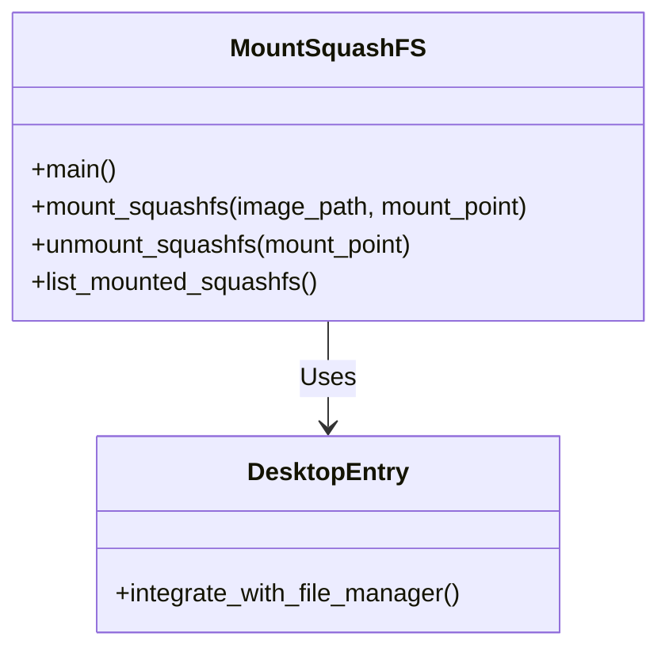
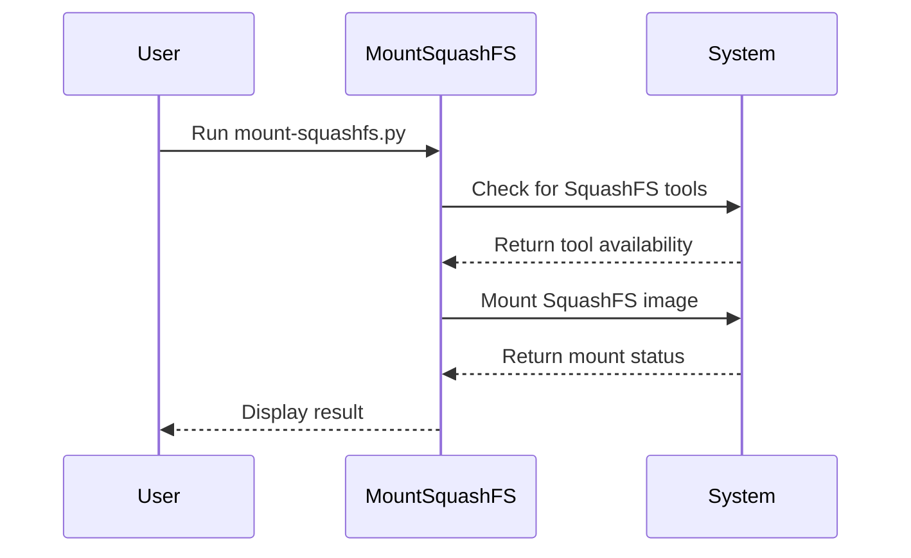
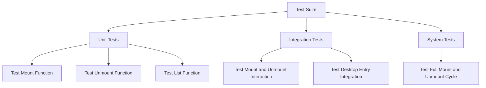
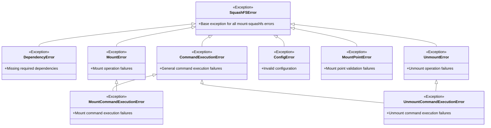

# Design Documentation

This document provides a comprehensive overview of the design and structure of the mount-squashfs-helper project.

## Project Overview

The mount-squashfs-helper is a Python-based utility designed to facilitate the mounting of SquashFS filesystems. It provides a user-friendly interface for managing SquashFS mounts, including mounting, unmounting, and listing mounted filesystems.

## Architecture

The project follows a simple yet effective architecture, leveraging Python's standard libraries and external tools to achieve its functionality. Below is a high-level overview of the architecture:

### Components

1. **Main Script (`mount-squashfs.py`)**: The entry point of the application, handling command-line arguments and orchestrating the mounting process.
2. **Desktop Entry (`squashfs-actions.desktop`)**: A desktop integration file that allows the utility to be accessed via the system's file manager.

### Class Diagram

### Sequence Diagram

## Implementation Details

### Main Script

The main script, `mount-squashfs.py`, is responsible for:

- **Command-Line Argument Parsing**: Handling user input for mounting, unmounting, and listing operations.
- **Mounting Process**: Executing the necessary commands to mount a SquashFS image to a specified mount point.
- **Unmounting Process**: Safely unmounting a previously mounted SquashFS filesystem.
- **Listing Mounted Filesystems**: Displaying a list of currently mounted SquashFS filesystems.

### Desktop Entry

The desktop entry file, `squashfs-actions.desktop`, integrates the utility with the system's file manager, allowing users to:

- **Mount SquashFS Images**: Right-click on a SquashFS image file and select the mount option.
- **Unmount SquashFS Filesystems**: Right-click on a mounted SquashFS filesystem and select the unmount option.

## Test Suite

The test suite is designed to ensure the reliability and correctness of the mount-squashfs-helper utility. It includes:

### Test Components

1. **Unit Tests**: Testing individual functions and methods to ensure they perform as expected.
2. **Integration Tests**: Testing the interaction between different components to ensure they work together seamlessly.
3. **System Tests**: Testing the overall functionality of the utility in a real-world scenario.

### Test Diagram

### Test Fixture Documentation

For detailed information about the test fixtures, parametrization strategy, and best practices, please consult the comprehensive test fixture documentation:

**📖 [tests/FIXTURE_DOCUMENTATION.md](tests/FIXTURE_DOCUMENTATION.md)**

This document provides:

- Complete fixture reference with usage examples
- Parametrization patterns and best practices
- Test organization guidelines
- Maintenance and evolution strategies
- Comprehensive coverage strategy

**Before modifying or adding tests, please review this documentation to understand the fixture architecture and parametrization approach.**

## Error Handling

The project includes comprehensive error handling to manage various scenarios that may occur during the mounting and unmounting processes. This includes handling missing dependencies, invalid file paths, permission issues, and command execution failures.

### Error Hierarchy

The error handling system uses a hierarchical approach with the following structure:

### Error Handling Strategy

1. **Dependency Checking**: The system verifies that required tools (squashfuse, fusermount) are available before attempting operations.

2. **File Validation**: Input files are validated to ensure they exist and are accessible.

3. **Mount Point Validation**: Mount points are checked to ensure they are valid and available.

4. **Command Execution**: Specific error types are used for mount vs. unmount command failures to enable precise error handling.

5. **Graceful Degradation**: When errors occur, the system provides clear error messages and maintains a stable state.

## Conclusion

The mount-squashfs-helper project is designed to be simple, effective, and user-friendly. It leverages Python's standard libraries and external tools to provide a robust solution for managing SquashFS filesystems. The comprehensive error handling system ensures that failures are properly categorized and handled, while the test suite guarantees the reliability and correctness of the utility, making it a dependable tool for users.
