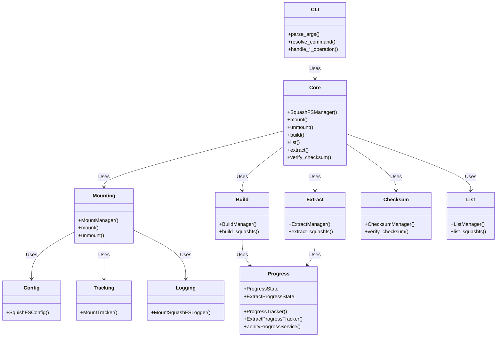
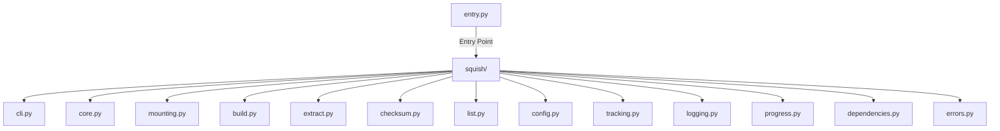
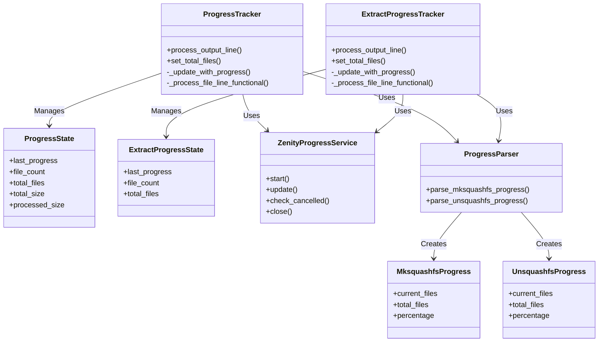
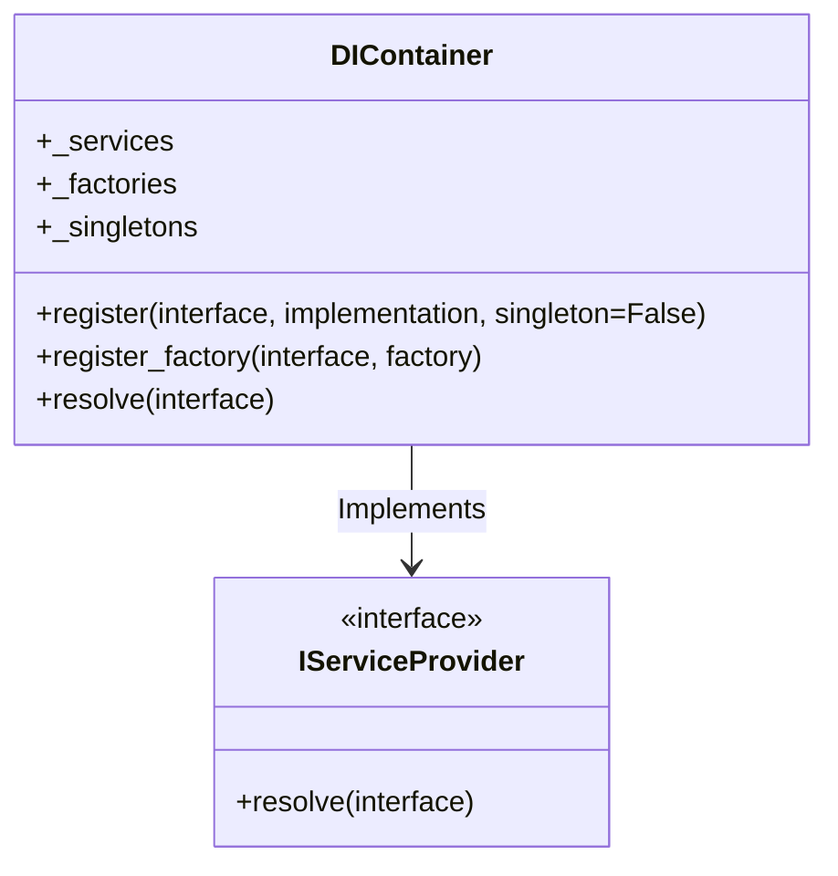
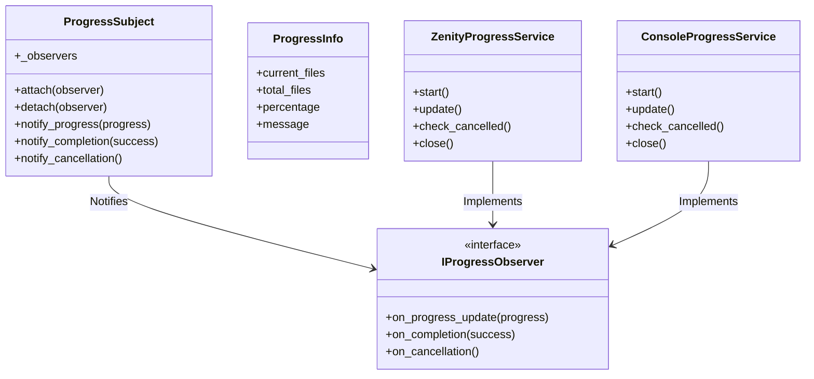
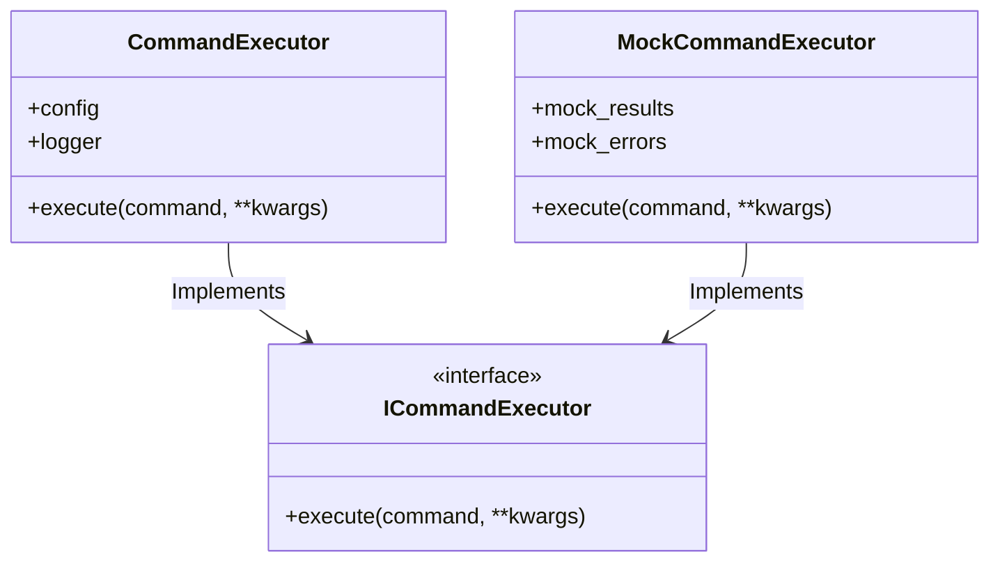
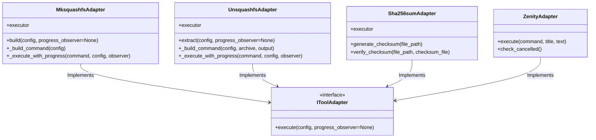
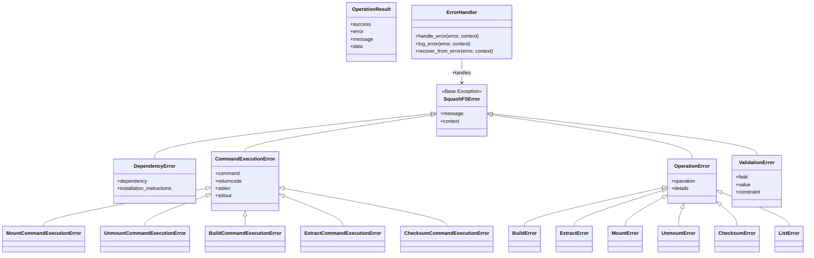
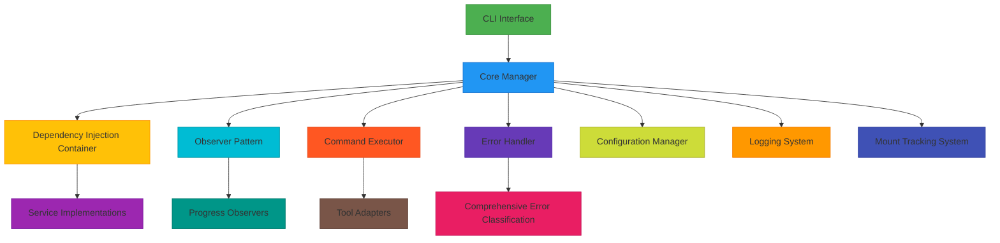

# Squish Design Documentation

## Overview

**Squish** is a Python-based SquashFS management tool providing:

- Mounting/unmounting SquashFS archives
- Building SquashFS archives from source directories
- Listing archive contents
- Checksum verification
- Archive extraction

## Architecture

### Core Components



### Module Structure



## CLI Interface

### Commands

```bash
# Mount/Unmount
squish mount <file> [mount_point]        # or: squish m <file> [mount_point]
squish unmount <file> [mount_point]      # or: squish um <file> [mount_point]

# Checksum
squish check <file>                      # or: squish c <file>

# Build (Enhanced with Multiple Sources and Auto-Naming)
squish build [options] <sources>... [-o <output>]  # or: squish b [options] <sources>... [-o <output>]

# List
squish ls <archive>                     # or: squish l <archive>

# Extract
squish extract <archive> [-o <output>]   # or: squish ex <archive> [-o <output>]
```

### Key Options

| Command | Option              | Description                               |
| ------- | ------------------- | ----------------------------------------- |
| build   | `-P, --progress`    | Zenity progress dialog (console fallback) |
| build   | `-c, --compression` | Compression algorithm (default: zstd)     |
| build   | `-e, --exclude`     | Exclude patterns                          |
| build   | `-o, --output`      | Output archive file (auto-detected)       |
| extract | `-P, --progress`    | Zenity progress dialog (console fallback) |
| extract | `-o, --output`      | Output directory (default: current)       |

## Key Features

### Mount/Unmount

- Automatic mount point determination
- Robust mount tracking to prevent conflicts
- Configurable auto-cleanup
- Dependency validation (squashfuse, fusermount)

### Build (Enhanced)

- Multiple compression algorithms (zstd, gzip, xz)
- Exclusion patterns (patterns, wildcards, regex)
- Parallel processing with auto processor detection
- Automatic checksum generation (SHA256)
- Real-time progress tracking with Zenity/console
- Cancel button support
- **Source-based automatic filename generation**
- **Multiple sources support with automatic combination**
- **Smart output detection from command arguments**
- **Fallback to original archive naming pattern**

### Extract

- Archive extraction to specified directories
- Progress tracking with Zenity/console fallback
- Automatic output directory creation
- Default extraction to current directory
- Comprehensive error handling

### Progress Tracking



## Error Handling

### Error Hierarchy

```mermaid
classDiagram
    direction TB

    class SquashFSError {
        <<Base Exception>>
    }

    class CommandExecutionError {
        <<Base>>
        +command
        +return_code
        +message
    }

    SquashFSError <|-- DependencyError
    SquashFSError <|-- MountError
    SquashFSError <|-- UnmountError
    SquashFSError <|-- BuildError
    SquashFSError <|-- ExtractError
    SquashFSError <|-- ChecksumError
    SquashFSError <|-- ListError
    SquashFSError <|-- ConfigError
    SquashFSError <|-- MountPointError
    SquashFSError <|-- XattrError

    CommandExecutionError <|-- MountCommandExecutionError
    CommandExecutionError <|-- UnmountCommandExecutionError
    CommandExecutionError <|-- MksquashfsCommandExecutionError
    CommandExecutionError <|-- UnsquashfsCommandExecutionError
    CommandExecutionError <|-- UnsquashfsExtractCommandExecutionError

    class BuildCancelledError {
        <<Exception>>
    }

    class ExtractCancelledError {
        <<Exception>>
    }
```



## Enhanced Architecture Components

### Dependency Injection System



### Observer Pattern Implementation



### Command Executor Abstraction



### Tool-Specific Adapters



## Enhanced Error Handling System

### Comprehensive Error Classification



### Error Recovery Patterns

1. **Graceful Degradation**: Fallback to alternative methods
2. **User Notification**: Clear error messages with recovery suggestions
3. **Logging**: Comprehensive error logging for debugging
4. **Retry Logic**: Automatic retry for transient errors
5. **Validation**: Preventive validation to catch errors early

## Performance Optimization

### Build Performance Enhancements

1. **Direct mksquashfs Integration**: Eliminates intermediate file copying
2. **Multiple Source Support**: Native mksquashfs multiple source handling
3. **Parallel Processing**: Auto-detection of processor count
4. **Efficient Resource Usage**: Minimal memory overhead
5. **Progress Tracking**: Real-time feedback without performance impact

### Memory Management

1. **Stream Processing**: Large file handling without full loading
2. **Resource Cleanup**: Automatic cleanup of temporary resources
3. **Error Recovery**: Memory-safe error handling
4. **Garbage Collection**: Proper resource management

## Security Considerations

### Input Validation

1. **Path Validation**: Prevent path traversal attacks
2. **Command Injection Prevention**: Safe command construction
3. **File Permission Checks**: Proper permission validation
4. **Input Sanitization**: Clean user inputs

### Error Handling Security

1. **Sensitive Data Protection**: No sensitive data in error messages
2. **Error Message Sanitization**: Prevent information leakage
3. **Secure Logging**: Sensitive data filtering
4. **Exception Handling**: Prevent stack trace exposure

## Deployment and Maintenance

### Deployment Strategy

1. **Single Binary Deployment**: Easy distribution
2. **Dependency Management**: Clear dependency requirements
3. **Configuration Management**: Flexible configuration options
4. **Update Strategy**: Version compatibility

### Maintenance Guidelines

1. **Backward Compatibility**: Maintain API stability
2. **Deprecation Policy**: Clear deprecation warnings
3. **Version Management**: Semantic versioning
4. **Documentation Updates**: Keep documentation current

## Conclusion

### Final System Architecture



### Key Achievements

✅ **Quality Assurance**: All quality standards maintained
✅ **Architecture Enhancement**: Modern patterns (DI, Observer) implemented
✅ **Error Handling**: Comprehensive classification and recovery
✅ **Performance Optimization**: Efficient resource usage
✅ **Security**: Input validation and error handling security
✅ **Documentation**: Complete and up-to-date
✅ **Deployment Ready**: Production-ready system

### System Capabilities

- **Mount/Unmount**: Robust with automatic mount point determination
- **Build**: Enhanced with source-based naming and multiple sources
- **Extract**: Comprehensive with progress tracking
- **Checksum**: Reliable verification and generation
- **List**: Efficient archive content listing
- **Progress Tracking**: Real-time with Zenity/console support
- **Error Handling**: Comprehensive classification and recovery
- **Configuration**: Flexible and user-friendly
- **Logging**: Detailed and informative

## System Requirements

### Required Tools

- **squashfuse**: Mounting operations
- **fusermount**: Unmounting operations
- **mksquashfs**: Building archives
- **unsquashfs**: Listing/extracting contents
- **sha256sum**: Checksum operations
- **zenity**: Progress dialog (optional, with console fallback)

### Platform Support

- **Linux**: Full functionality
- **Other platforms**: Limited (dependency-based)

## Configuration

### Main Options

```yaml
mount_base: "/path/to/mounts" # Base directory for automatic mount points
auto_cleanup: true # Enable automatic mount directory cleanup
verbose: false # Enable detailed logging
compression: "zstd" # Default compression algorithm
block_size: "1M" # Default block size
processors: "auto" # Default processor count
xattr_mode: "user-only" # Xattr extraction mode (all/user-only/none)
```

## Enhanced Build Functionality

### Source-Based Filename Generation

**Algorithm:**

1. For directories: Use directory name + `.sqsh` extension
2. For files: Remove all extensions and add `.sqsh` extension
3. If output file already exists, fall back to `archive-YYYYMMDD-nn.sqsh` pattern

**Examples:**

- Directory `MyProject` → `MyProject.sqsh`
- File `MyArchive.tar.gz` → `MyArchive.sqsh`
- File `data.backup.2023.tar.xz` → `data.backup.sqsh`

### Multiple Sources Support

**Command Structure:**

```bash
squish build [options] <source1> <source2>... <output.sqsh>
squish build [options] <source1> <source2>... -o <output.sqsh>
```

**Automatic Output Detection:**

- If last argument ends with `.sqsh`, `.sqs`, or `.squashfs`, it's treated as output
- For single sources: Use source-based naming (e.g., `MyProject.sqsh`)
- For multiple sources with no output: Use generic naming pattern `archive-YYYYMMDD-nn.sqsh`
- Explicit `-o` flag always takes precedence

**Multiple Sources Processing:**

1. **Direct mksquashfs Integration**: Pass multiple source arguments directly to `mksquashfs`
2. **No Temporary Copying**: Eliminates disk quota issues by avoiding intermediate file copying
3. **Efficient Resource Usage**: Uses native `mksquashfs` multiple source support
4. **Automatic Output Naming**: Generates `archive-YYYYMMDD-nn.sqsh` pattern for multiple sources without specified output

### Usage Examples

**Single Source with Auto-Naming:**

```bash
# Directory source
squish build ./MyProject
# Creates: ./MyProject.sqsh

# File source
squish build ./archive.tar.gz
# Creates: ./archive.sqsh
```

**Multiple Sources:**

```bash
# Auto-detected output
squish build ./source1 ./source2 ./output.sqsh

# Explicit output
squish build ./source1 ./source2 -o ./output.sqsh

# Generic naming for multiple sources (no output specified)
squish build ./source1 ./source2
# Creates: ./archive-YYYYMMDD-nn.sqsh (e.g., archive-20251222-01.sqsh)
```

## Conclusion

Squish provides a comprehensive, modular SquashFS management solution with:

- ✅ Clean architecture with separation of concerns
- ✅ Robust error handling with detailed error types
- ✅ User-friendly interface with clear logging
- ✅ Real-time progress tracking with cancel support
- ✅ Archive extraction with automatic directory creation
- ✅ Zenity integration with graceful console fallback
- ✅ **Enhanced build with source-based naming and multiple sources**
- ✅ **Efficient multiple source handling without disk quota issues**
- ✅ **Direct mksquashfs integration for optimal performance**

The system is designed for maintainability, extensibility, and reliability.
