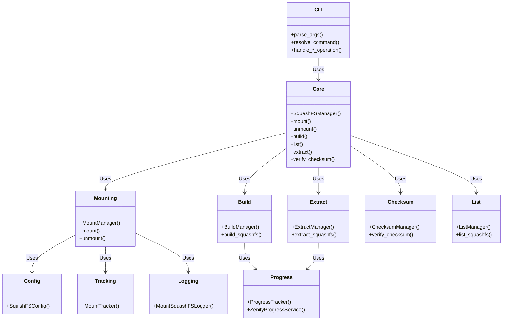
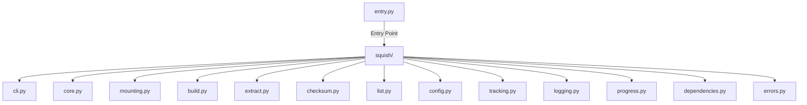
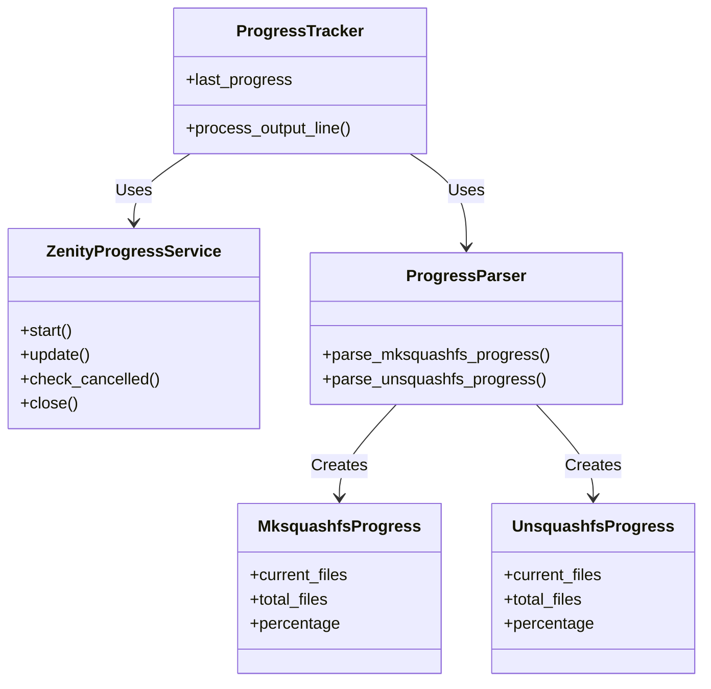
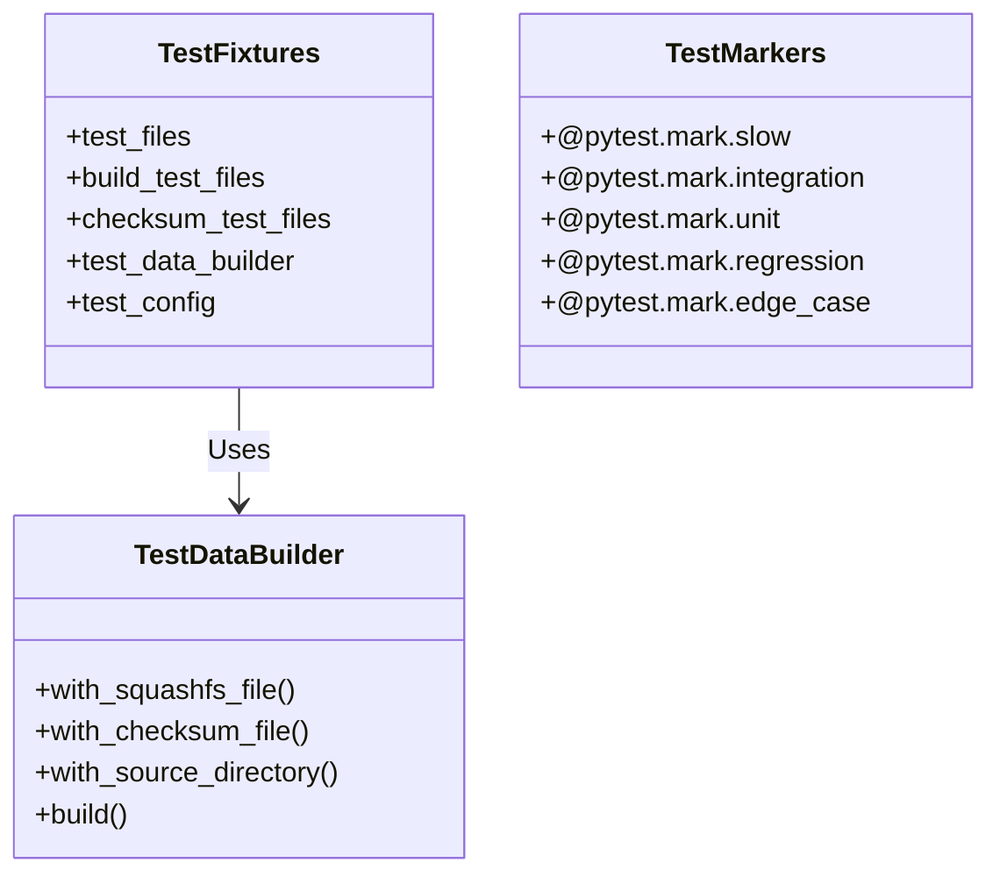

# Squish Design Documentation

## Overview

**Squish** is a Python-based SquashFS management tool providing:

- Mounting/unmounting SquashFS archives
- Building SquashFS archives from source directories
- Listing archive contents
- Checksum verification
- Archive extraction

## Architecture

### Core Components



### Module Structure



## CLI Interface

### Commands

```bash
# Mount/Unmount
squish mount <file> [mount_point]        # or: squish m <file> [mount_point]
squish unmount <file> [mount_point]      # or: squish um <file> [mount_point]

# Checksum
squish check <file>                      # or: squish c <file>

# Build
squish build [options] <source> <output> # or: squish b [options] <source> <output>

# List
squish ls <archive>                     # or: squish l <archive>

# Extract
squish extract <archive> [-o <output>]   # or: squish ex <archive> [-o <output>]
```

### Key Options

| Command | Option              | Description                               |
| ------- | ------------------- | ----------------------------------------- |
| build   | `-P, --progress`    | Zenity progress dialog (console fallback) |
| build   | `-c, --compression` | Compression algorithm (default: zstd)     |
| build   | `-e, --exclude`     | Exclude patterns                          |
| extract | `-P, --progress`    | Zenity progress dialog (console fallback) |
| extract | `-o, --output`      | Output directory (default: current)       |

## Key Features

### Mount/Unmount

- Automatic mount point determination
- Robust mount tracking to prevent conflicts
- Configurable auto-cleanup
- Dependency validation (squashfuse, fusermount)

### Build

- Multiple compression algorithms (zstd, gzip, xz)
- Exclusion patterns (patterns, wildcards, regex)
- Parallel processing with auto processor detection
- Automatic checksum generation (SHA256)
- Real-time progress tracking with Zenity/console
- Cancel button support

### Extract

- Archive extraction to specified directories
- Progress tracking with Zenity/console fallback
- Automatic output directory creation
- Default extraction to current directory
- Comprehensive error handling

### Progress Tracking



## Error Handling

### Error Hierarchy

```mermaid
classDiagram
    direction TB

    class SquashFSError {
        <<Base Exception>>
    }

    class CommandExecutionError {
        <<Base>>
        +command
        +return_code
        +message
    }

    SquashFSError <|-- DependencyError
    SquashFSError <|-- MountError
    SquashFSError <|-- UnmountError
    SquashFSError <|-- BuildError
    SquashFSError <|-- BuildCancelledError
    SquashFSError <|-- ExtractError
    SquashFSError <|-- ExtractCancelledError
    SquashFSError <|-- ChecksumError
    SquashFSError <|-- ListError
    SquashFSError <|-- ConfigError
    SquashFSError <|-- MountPointError
    SquashFSError <|-- XattrError

    CommandExecutionError <|-- MountCommandExecutionError
    CommandExecutionError <|-- UnmountCommandExecutionError
    CommandExecutionError <|-- MksquashfsCommandExecutionError
    CommandExecutionError <|-- UnsquashfsCommandExecutionError
    CommandExecutionError <|-- UnsquashfsExtractCommandExecutionError
```



## Testing

### Test Coverage (Current)

```
TOTAL: 94% coverage (1204 statements, 59 missing)

Module Coverage:
- 100%: __init__.py, checksum.py, config.py, errors.py, logging.py, tracking.py
- 97-99%: build.py, core.py, progress.py
- 88-94%: cli.py, dependencies.py, extract.py, list.py, mounting.py
```

### Test Architecture



## System Requirements

### Required Tools

- **squashfuse**: Mounting operations
- **fusermount**: Unmounting operations
- **mksquashfs**: Building archives
- **unsquashfs**: Listing/extracting contents
- **sha256sum**: Checksum operations
- **zenity**: Progress dialog (optional, with console fallback)

### Platform Support

- **Linux**: Full functionality
- **Other platforms**: Limited (dependency-based)

## Configuration

### Main Options

```yaml
mount_base: "/path/to/mounts" # Base directory for automatic mount points
auto_cleanup: true # Enable automatic mount directory cleanup
verbose: false # Enable detailed logging
compression: "zstd" # Default compression algorithm
block_size: "1M" # Default block size
processors: "auto" # Default processor count
xattr_mode: "user-only" # Xattr extraction mode (all/user-only/none)
```

## Conclusion

Squish provides a comprehensive, modular SquashFS management solution with:

- ✅ Clean architecture with separation of concerns
- ✅ Robust error handling with detailed error types
- ✅ Comprehensive testing (94% coverage)
- ✅ User-friendly interface with clear logging
- ✅ Real-time progress tracking with cancel support
- ✅ Archive extraction with automatic directory creation
- ✅ Zenity integration with graceful console fallback

The system is designed for maintainability, extensibility, and reliability.
