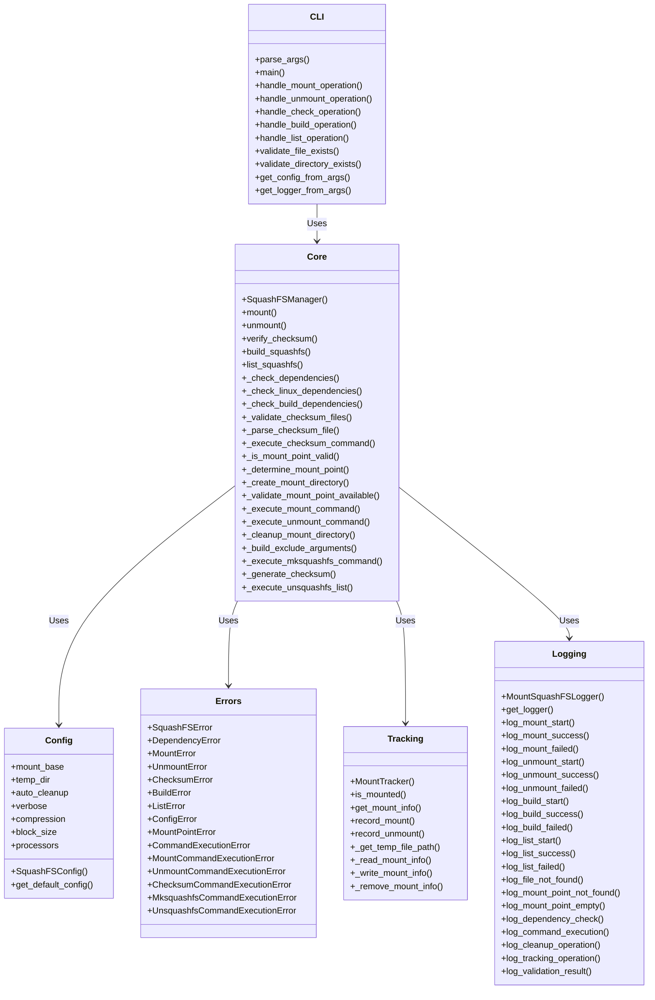
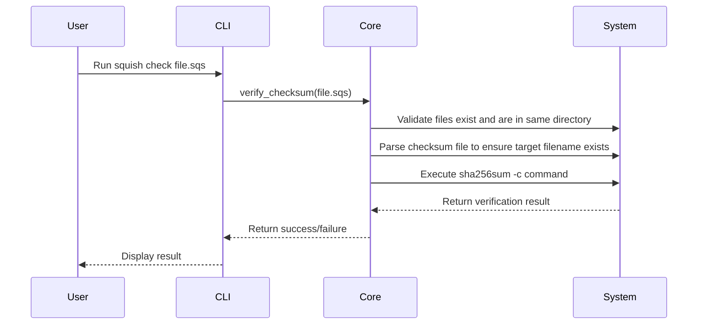
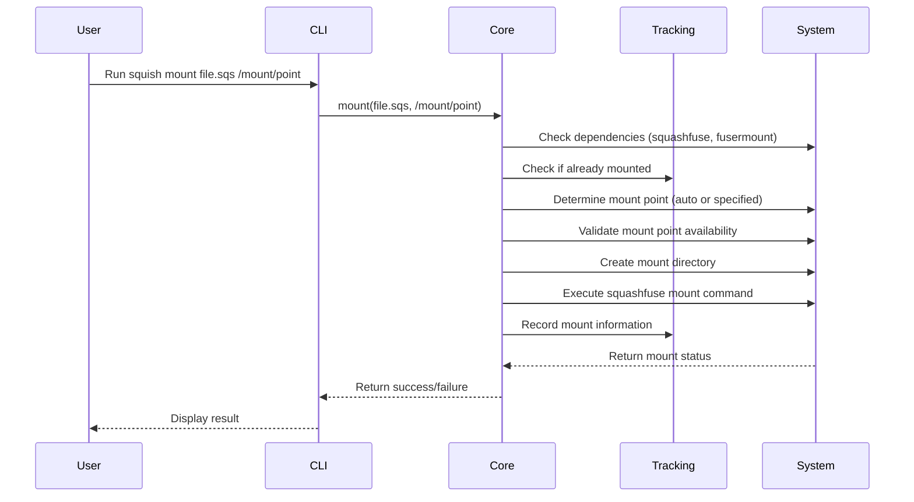
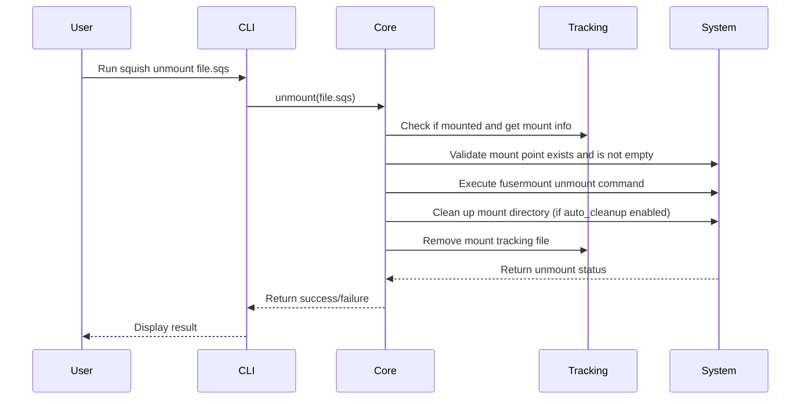
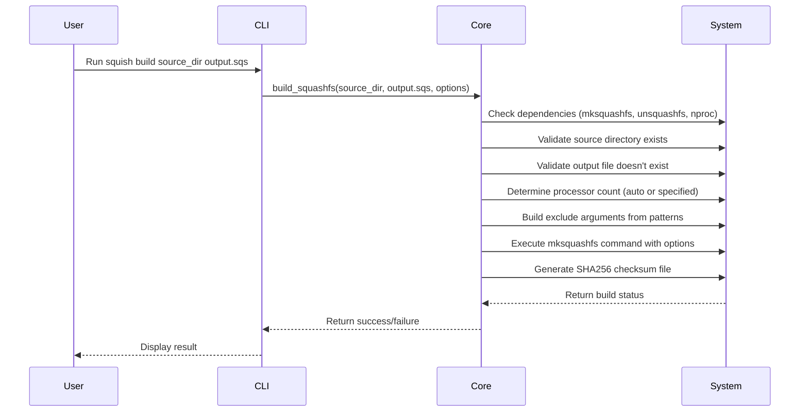
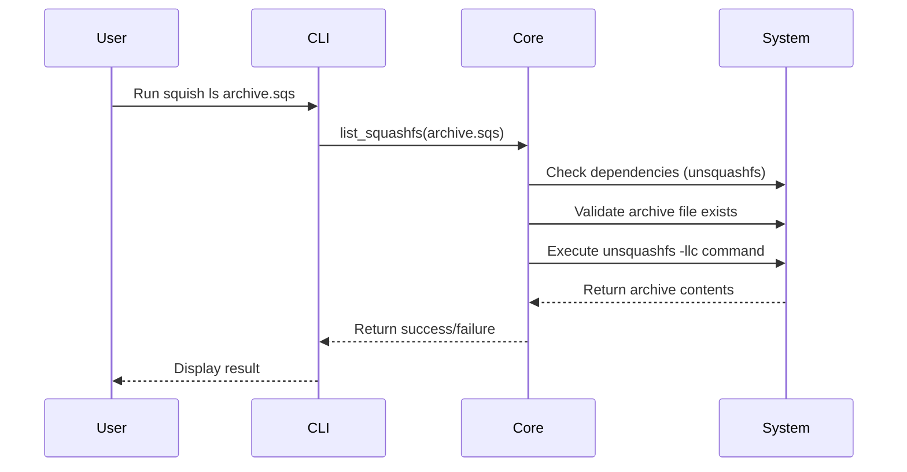
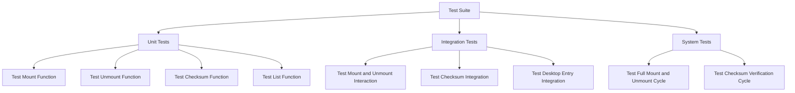
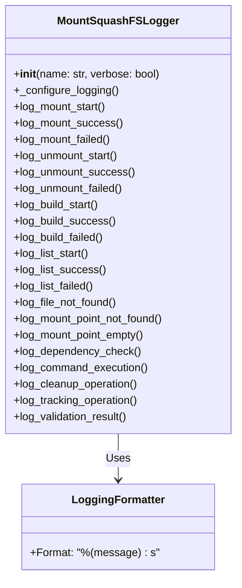

# Design Documentation

This document provides a comprehensive overview of the design and structure of the squish project.

## Project Overview

The squish utility is a Python-based tool designed for comprehensive management of SquashFS filesystems. It provides a robust interface for mounting, unmounting, building, listing contents, and checksum verification of SquashFS archives.

## Architecture

The project follows a modular architecture leveraging Python's standard libraries and external tools. Below is a high-level overview of the current architecture:

### Components

1. **Entry Point (`entry.py`)**: The main entry point for the application, handling both direct execution and zipapp bundle scenarios. This module is not covered by tests as it only serves as an entrypoint.
2. **Desktop Entry (`squashfs-actions.desktop`)**: A desktop integration file that allows the utility to be accessed via the system's file manager.

### Module Structure

The project follows a modular architecture with the following key modules:

### CLI Commands and Options

The CLI module provides a comprehensive command-line interface with the following subcommands and options:

- **mount**: Mount a SquashFS archive
  - `mount <file> [mount_point]`
  - Mounts the squashfs file to the specified mount point or auto-determines the mount point

- **unmount**: Unmount a SquashFS archive
  - `unmount <file> [mount_point]`
  - Unmounts the squashfs file from the specified mount point or uses the tracked mount point

- **check**: Verify checksum of a SquashFS archive
  - `check <file>`
  - Verifies the SHA256 checksum of the file if a corresponding .sha256 file exists

- **build**: Create a SquashFS archive
  - `build [options] <source> <output>`
  - Options include:
    - `-e, --exclude`: Add exclude patterns
    - `-f, --exclude-file`: Use a file with exclude patterns
    - `-w, --wildcards`: Enable wildcard matching
    - `-r, --regex`: Enable regex matching
    - `-c, --compression`: Compression algorithm (default: zstd)
    - `-b, --block-size`: Block size (default: 1M)
    - `-p, --processors`: Number of processors (default: auto)

- **ls**: List contents of a SquashFS archive
  - `ls <archive>`
  - Lists the contents of the SquashFS archive using unsquashfs

- **Global options**:
  - `-v, --verbose`: Enable verbose output for detailed logging

### Sequence Diagram - Checksum Verification

### Sequence Diagram - Mount Operation

### Sequence Diagram - Unmount Operation

### Sequence Diagram - Build Operation

### Sequence Diagram - List Operation

## Implementation Details

### Entry Point

The entry point, `entry.py`, serves as the main entry point for the application and handles:

- **Bundle Support**: Provides compatibility for both direct execution and zipapp bundle scenarios.
- **Error Handling**: Graceful handling of import errors and unexpected exceptions.
- **Path Management**: Ensures proper module import paths in bundled environments.

**Note**: This module is intentionally not covered by tests as it only serves as an entrypoint for zipapp bundling and contains minimal logic.

### CLI Module

The CLI module, `squish/cli.py`, is responsible for:

- **Command-Line Argument Parsing**: Handling user input with subcommands for mount, unmount, check, build, and list operations.
- **Operation Orchestration**: Coordination between user commands and core functionality.
- **Validation**: File and directory existence validation with appropriate error handling.
- **Global Configuration**: Verbose mode support and configuration management.
- **Logger Management**: Centralized logger creation and configuration based on command-line arguments.
- **Error Handling**: Comprehensive error handling with graceful exit codes for all operations.

### Core Module

The core module, `squish/core.py`, contains the main business logic:

- **SquashFSManager**: Main class handling all core operations including dependency checking, mount point validation, and operation execution.
- **Mount/Unmount Operations**: Comprehensive mounting and unmounting with safety checks, tracking, and automatic cleanup.
- **Build Operations**: SquashFS archive creation with various compression algorithms, exclusion patterns, and parallel processing.
- **List Operations**: Archive content listing functionality with detailed output.
- **Checksum Verification**: File integrity verification using SHA256 checksums with automatic checksum file generation.
- **Dependency Management**: Automatic checking of required system tools with platform-specific validation.
- **Mount Tracking**: Robust tracking system to prevent duplicate mounting and ensure proper cleanup.
- **Security**: Validation of file paths and mount points to prevent path traversal and other security issues.

### Desktop Entry

The desktop entry file, `squashfs-actions.desktop`, integrates the utility with the system's file manager, allowing users to:

- **Mount SquashFS Images**: Right-click on a SquashFS image file and select the mount option.
- **Unmount SquashFS Filesystems**: Right-click on a mounted SquashFS filesystem and select the unmount option.

### Configuration Module

The configuration module, `squish/config.py`, provides:

- **SquashFSConfig**: Dataclass-based configuration with validation and default values.
- **Configurable Parameters**: Mount base directory, temporary directory, auto-cleanup behavior, verbose mode, compression settings, block size, and processor count.
- **Validation**: Automatic validation of configuration values during initialization.
- **Flexibility**: Support for different compression algorithms (zstd, gzip, xz, etc.) and configurable block sizes.

### Logging Module

The logging module, `squish/logging.py`, provides:

- **MountSquashFSLogger**: Custom logger with structured logging and user-friendly output.
- **Verbose Mode Support**: Detailed logging for debugging and troubleshooting.
- **Comprehensive Logging Methods**: Specific logging methods for all operations and error conditions.
- **Clean Output Format**: Message-only format without timestamps or redundant prefixes.
- **Contextual Logging**: Operation-specific logging with contextual information.

### Tracking Module

The tracking module, `squish/tracking.py`, provides:

- **MountTracker**: Robust tracking system using temporary files to track mounted archives.
- **Conflict Detection**: Prevention of path conflicts between different files with the same name.
- **Mount Information Management**: Reading, writing, and removing mount tracking information.
- **Error Handling**: Graceful handling of tracking file operations and conflicts.
- **Path Resolution**: Ensures consistent tracking across different file paths that resolve to the same location.

### Error Handling Module

The error handling module, `squish/errors.py`, provides:

- **Comprehensive Error Hierarchy**: Base SquashFSError with specific subclasses for different operation types.
- **Command Execution Errors**: Detailed error information including command names, return codes, and messages.
- **Operation-Specific Errors**: MountError, UnmountError, BuildError, ListError, ChecksumError, etc.
- **Configuration and Validation Errors**: ConfigError, MountPointError, DependencyError.
- **Detailed Error Messages**: Clear error messages with specific context for debugging and troubleshooting.

## Test Suite

The test suite is designed to ensure the reliability and correctness of the squish utility. It includes comprehensive testing for all core modules except `entry.py`, which is intentionally not tested as it only serves as an entrypoint for zipapp bundling.

### Test Components

1. **Unit Tests**: Testing individual functions and methods to ensure they perform as expected.
2. **Integration Tests**: Testing the interaction between different components to ensure they work together seamlessly.
3. **System Tests**: Testing the overall functionality of the utility in a real-world scenario.
4. **Checksum Tests**: Testing the checksum verification functionality.

### Test Diagram

### Test Fixture Documentation

For detailed information about the test fixtures, parametrization strategy, and best practices, please consult the comprehensive test fixture documentation:

**📖 [tests/FIXTURE_DOCUMENTATION.md](tests/FIXTURE_DOCUMENTATION.md)**

This document provides:

- Complete fixture reference with usage examples
- Parametrization patterns and best practices
- Test organization guidelines
- Maintenance and evolution strategies
- Comprehensive coverage strategy

**Before modifying or adding tests, please review this documentation to understand the fixture architecture and parametrization approach.**

## Error Handling

The project includes comprehensive error handling to manage various scenarios that may occur during SquashFS operations. This includes handling missing dependencies, invalid file paths, permission issues, command execution failures, and mount tracking conflicts.

### Error Hierarchy

The error handling system uses a comprehensive hierarchical approach with the following structure:

```mermaid
classDiagram
    class SquashFSError {
        <<Exception>>
        +Base exception for all squish errors
    }

    class DependencyError {
        <<Exception>>
        +Missing required dependencies
    }

    class MountError {
        <<Exception>>
        +Mount operation failures
    }

    class UnmountError {
        <<Exception>>
        +Unmount operation failures
    }

    class ChecksumError {
        <<Exception>>
        +Checksum verification failures
    }

    class BuildError {
        <<Exception>>
        +Build operation failures
    }

    class ListError {
        <<Exception>>
        +List operation failures
    }

    class ConfigError {
        <<Exception>>
        +Invalid configuration
    }

    class MountPointError {
        <<Exception>>
        +Mount point validation failures
    }

    class CommandExecutionError {
        <<Exception>>
        +General command execution failures
        +command: str
        +return_code: int
        +message: str
    }

    class MountCommandExecutionError {
        <<Exception>>
        +Mount command execution failures
    }

    class UnmountCommandExecutionError {
        <<Exception>>
        +Unmount command execution failures
    }

    class ChecksumCommandExecutionError {
        <<Exception>>
        +Checksum command execution failures
    }

    class MksquashfsCommandExecutionError {
        <<Exception>>
        +Build command execution failures
    }

    class UnsquashfsCommandExecutionError {
        <<Exception>>
        +List command execution failures
    }

    SquashFSError <|-- DependencyError
    SquashFSError <|-- MountError
    SquashFSError <|-- UnmountError
    SquashFSError <|-- ChecksumError
    SquashFSError <|-- BuildError
    SquashFSError <|-- ListError
    SquashFSError <|-- ConfigError
    SquashFSError <|-- MountPointError
    SquashFSError <|-- CommandExecutionError
    CommandExecutionError <|-- MountCommandExecutionError
    CommandExecutionError <|-- UnmountCommandExecutionError
    CommandExecutionError <|-- ChecksumCommandExecutionError
    CommandExecutionError <|-- MksquashfsCommandExecutionError
    CommandExecutionError <|-- UnsquashfsCommandExecutionError
    ChecksumError <|-- ChecksumCommandExecutionError
    MountError <|-- MountCommandExecutionError
    UnmountError <|-- UnmountCommandExecutionError
    BuildError <|-- MksquashfsCommandExecutionError
    ListError <|-- UnsquashfsCommandExecutionError
```

### Error Handling Strategy

1. **Dependency Checking**: The system verifies that required tools (squashfuse, fusermount, sha256sum, mksquashfs, unsquashfs, nproc) are available before attempting operations.

2. **File Validation**: Input files are validated to ensure they exist and are accessible.

3. **Directory Validation**: Source directories for build operations are validated to ensure they exist and are accessible.

4. **Mount Point Validation**: Mount points are checked to ensure they are valid, available, and not empty.

5. **Checksum Validation**: For checksum operations, the system validates that both the target file and checksum file exist in the same directory and that the checksum file contains the target filename.

6. **Command Execution**: Specific error types are used for different operation failures (mount, unmount, checksum, build, list) to enable precise error handling and detailed error messages.

7. **Build Validation**: Source directories and output files are validated before build operations to prevent overwriting existing files.

8. **List Validation**: Archive files are validated before listing operations.

9. **Mount Tracking**: Robust tracking system prevents duplicate mounting and ensures proper state management.

10. **Conflict Detection**: Tracking system detects and handles conflicts between different files with the same name.

11. **Graceful Degradation**: When errors occur, the system provides clear error messages and maintains a stable state.

12. **Automatic Cleanup**: Mount directories are automatically cleaned up after unmounting (configurable).

## Logging System

The squish utility includes a comprehensive logging system designed to provide clear, concise, and user-friendly output while maintaining all necessary technical information for debugging.

### Logging Architecture

### Logging Design Principles

1. **User-Friendly Output**: All logging messages are designed to be clear and actionable for end users
2. **Concise Format**: Eliminated timestamps, logger names, and redundant prefixes
3. **Contextual Information**: Provides relevant target information in error messages
4. **Consistent Pattern**: All logging follows the same structured format
5. **Appropriate Log Levels**: Uses INFO for normal operations, ERROR for failures, WARNING for recoverable issues

### Logging Message Format

**Success Operations:**

- `Mounted: file.sqsh -> /mount/point`
- `Unmounted: file.sqsh -> /mount/point`
- `Built: source_dir -> output.sqs`
- `Listed: archive.sqs`
- `Dependency available: fusermount`
- `Command executed: mount -o ro file.sqsh /mount/point`

**Error Operations:**

- `Mount failed: file.sqsh -> /mount/point: Permission denied`
- `Unmount failed: file.sqsh: File is not mounted` (special case without mount point)
- `Build failed: source_dir -> output.sqs: Permission denied`
- `List failed: archive.sqs: File not found`
- `Dependency missing: required_command`
- `Command failed: mount -o ro file.sqsh /mount/point`

**Warning Operations:**

- `Mount point empty: /mount/point`
- `Cleanup failed: directory_removal on /mount/point`
- `Validation failed: mount_point for /mount/point`
- `Build validation failed: source_dir`
- `List validation failed: archive.sqs`

### Special Case Handling

The logging system includes intelligent handling for special cases:

1. **Placeholder Mount Points**: When mount points are not real paths (e.g., "not_mounted", "auto", "no_mount_info"), the system omits the arrow notation to avoid confusion:
   - `Unmount failed: file.sqsh: File is not mounted` (instead of `Unmount failed: file.sqsh -> not_mounted: File is not mounted`)

2. **Verbose Mode**: When verbose mode is enabled, additional debug-level messages are shown for detailed troubleshooting.

### Integration with Error Handling

The logging system is tightly integrated with the error handling system:

- All exceptions trigger appropriate log messages before being raised
- Log messages provide the same contextual information as exception messages
- Error messages include relevant file paths and specific error details
- The system maintains consistency between logged messages and exception messages

## Conclusion

The squish project is designed to be comprehensive, effective, and user-friendly. It leverages Python's standard libraries and external tools to provide a robust solution for managing SquashFS filesystems. The comprehensive error handling system ensures that failures are properly categorized and handled, while the test suite guarantees the reliability and correctness of the utility, making it a dependable tool for users.

### Build Feature

The build feature allows users to create SquashFS archives from source directories with various options:

1. **Source and Output Specification**: Users can specify source directories and output archive files
2. **Exclusion Patterns**: Support for excluding files using patterns, wildcards, or regex
3. **Compression Options**: Configurable compression algorithms (default: zstd) and block sizes (default: 1M)
4. **Parallel Processing**: Support for multi-processor builds with automatic processor detection
5. **Automatic Checksum Generation**: Automatically generates SHA256 checksum files for created archives
6. **Validation**: Comprehensive validation of source directories and output paths to prevent overwriting

### List Feature

The list feature enables users to view the contents of SquashFS archives without mounting:

1. **Archive Validation**: Ensures the archive file exists and is accessible
2. **Content Listing**: Uses `unsquashfs -llc` to display detailed archive contents
3. **Error Handling**: Graceful handling of missing archives and command failures
4. **Dependency Checking**: Automatic verification of required tools (unsquashfs)

### Checksum Verification Feature

The checksum verification feature provides an additional layer of data integrity verification. When using the `check` command, the system:

1. **Validates file locations**: Ensures both the target file and checksum file are in the same directory
2. **Parses checksum file**: Verifies that the checksum file contains an entry for the target filename
3. **Executes verification**: Uses `sha256sum -c` to perform the actual checksum verification
4. **Provides clear feedback**: Returns success or detailed error messages for various failure scenarios

This feature enhances the utility's functionality by allowing users to verify the integrity of SquashFS files before mounting them, ensuring data consistency and security.

### Mount/Unmount Features

The mount and unmount features provide robust filesystem management:

1. **Automatic Mount Point Determination**: Automatic creation of mount points in a configurable base directory
2. **Mount Tracking**: Robust tracking system to prevent duplicate mounting and ensure proper cleanup
3. **Automatic Cleanup**: Configurable automatic cleanup of mount directories after unmounting
4. **Dependency Management**: Automatic checking of required system tools (squashfuse, fusermount)
5. **Safety Checks**: Comprehensive validation of mount points and filesystem states
6. **Conflict Detection**: Prevention of path conflicts between different files with the same name

### Configuration System

The configuration system provides flexible and robust settings management:

1. **Dataclass-based Configuration**: Type-safe configuration with validation
2. **Default Values**: Sensible defaults for all configuration parameters
3. **Customizable Settings**: Mount base directory, temporary directory, auto-cleanup behavior, verbose mode
4. **Build Configuration**: Compression algorithm, block size, processor count
5. **Validation**: Automatic validation of configuration values during initialization
