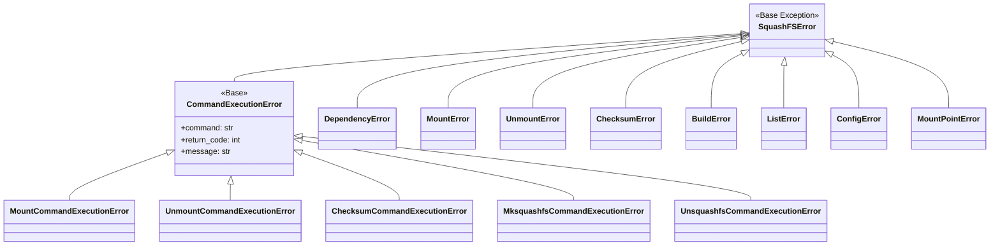

# Design Documentation

This document provides a concise overview of the squish project's architecture and key features.

## Project Overview

**squish** is a Python-based utility for comprehensive management of SquashFS filesystems, providing:
- Mounting and unmounting SquashFS archives
- Building SquashFS archives from source directories
- Listing contents of SquashFS archives
- Checksum verification for data integrity

## Architecture

The project follows a modular architecture with clear separation of concerns:

### Core Components

### Module Structure

- **`entry.py`**: Main entry point (not tested - zipapp bundling only)
- **`squashfs-actions.desktop`**: Desktop integration file
- **`squish/cli.py`**: Command-line interface and argument parsing
- **`squish/core.py`**: Main facade coordinating all operations
- **`squish/mounting.py`**: Mount/unmount functionality with tracking
- **`squish/build.py`**: SquashFS archive creation with progress tracking
- **`squish/checksum.py`**: SHA256 checksum verification
- **`squish/list.py`**: Archive content listing
- **`squish/config.py`**: Configuration management
- **`squish/tracking.py`**: Mount state tracking
- **`squish/logging.py`**: Custom logging system
- **`squish/dependencies.py`**: System tool validation
- **`squish/errors.py`**: Comprehensive error hierarchy

## CLI Interface

### Commands

- **mount**: `squish mount <file> [mount_point]`
- **unmount**: `squish unmount <file> [mount_point]`
- **check**: `squish check <file>`
- **build**: `squish build [options] <source> <output>`
- **ls**: `squish ls <archive>`

### Build Options

- `-e, --exclude`: Add exclude patterns
- `-f, --exclude-file`: Use file with exclude patterns
- `-w, --wildcards`: Enable wildcard matching
- `-r, --regex`: Enable regex matching
- `-c, --compression`: Compression algorithm (default: zstd)
- `-b, --block-size`: Block size (default: 1M)
- `-p, --processors`: Number of processors (default: auto)

## Key Features

### Mount/Unmount

- **Automatic mount point determination**
- **Robust mount tracking** to prevent conflicts
- **Configurable auto-cleanup** of mount directories
- **Dependency validation** (squashfuse, fusermount)
- **Comprehensive safety checks**

### Build

- **Multiple compression algorithms** (zstd, gzip, xz, etc.)
- **Exclusion patterns** (patterns, wildcards, regex)
- **Parallel processing** with automatic processor detection
- **Automatic checksum generation** (SHA256)
- **Validation** to prevent overwriting existing files

### Checksum Verification

- **SHA256 integrity checking**
- **Automatic checksum file detection**
- **File location validation**
- **Checksum file parsing**

### List

- **Archive content listing** without mounting
- **Detailed output** using unsquashfs
- **Dependency validation**

## Configuration

### Main Configuration Options

- `mount_base`: Base directory for automatic mount points
- `temp_dir`: Temporary directory for tracking files
- `auto_cleanup`: Enable automatic mount directory cleanup
- `verbose`: Enable detailed logging
- `compression`: Default compression algorithm
- `block_size`: Default block size
- `processors`: Default processor count

## Error Handling

### Error Hierarchy

### Key Error Types

- **DependencyError**: Missing system tools
- **MountError/UnmountError**: Mount operation failures
- **BuildError**: Archive creation failures
- **ChecksumError**: Verification failures
- **ConfigError**: Invalid configuration
- **MountPointError**: Mount point validation issues
- **CommandExecutionError**: Command execution failures (with specific subclasses)

## Testing

### Test Architecture

- **Fixture-based approach** with test data builder
- **Comprehensive coverage** (90%+ target)
- **Mocking strategy** for external dependencies
- **Error path testing** for all operations

### Key Test Components

- **`test_files`**: Basic test files fixture
- **`build_test_files`**: Build-focused test files
- **`checksum_test_files`**: Checksum verification tests
- **`test_data_builder`**: Custom test data creation
- **Module-specific fixtures**: For each major module

## Logging

### Design Principles

- **User-friendly output** (no timestamps, clean format)
- **Contextual information** in all messages
- **Consistent pattern** across all operations
- **Verbose mode** for detailed debugging

### Message Format

- **Success**: `Mounted: file.sqsh -> /mount/point`
- **Error**: `Mount failed: file.sqsh -> /mount/point: Permission denied`
- **Warning**: `Mount point empty: /mount/point`

## System Requirements

### Required Tools

- **squashfuse**: For mounting operations
- **fusermount**: For unmounting operations
- **mksquashfs**: For building archives
- **unsquashfs**: For listing contents
- **sha256sum**: For checksum operations
- **nproc**: For processor count detection

### Platform Support

- **Linux**: Full functionality
- **Other platforms**: Limited functionality (dependency-based)

## Conclusion

squish provides a comprehensive, modular solution for SquashFS management with:
- **Clean architecture** with separation of concerns
- **Robust error handling** with detailed error types
- **Comprehensive testing** with high coverage
- **User-friendly interface** with clear logging
- **Flexible configuration** for different use cases
