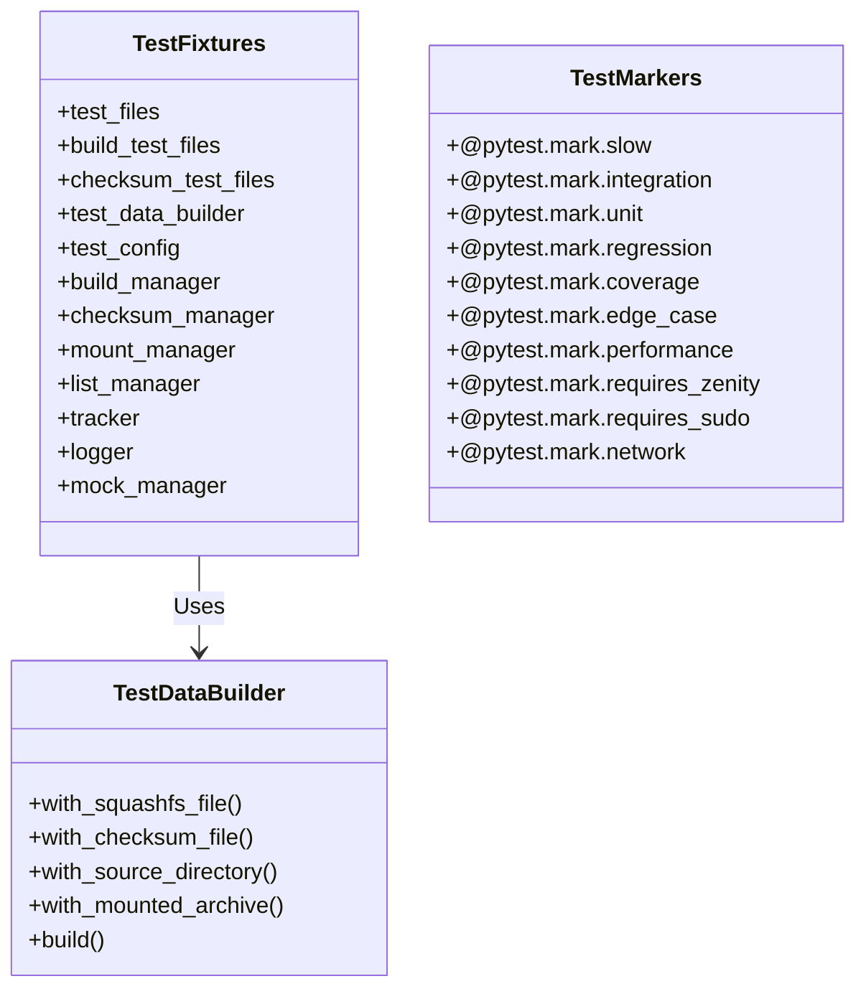
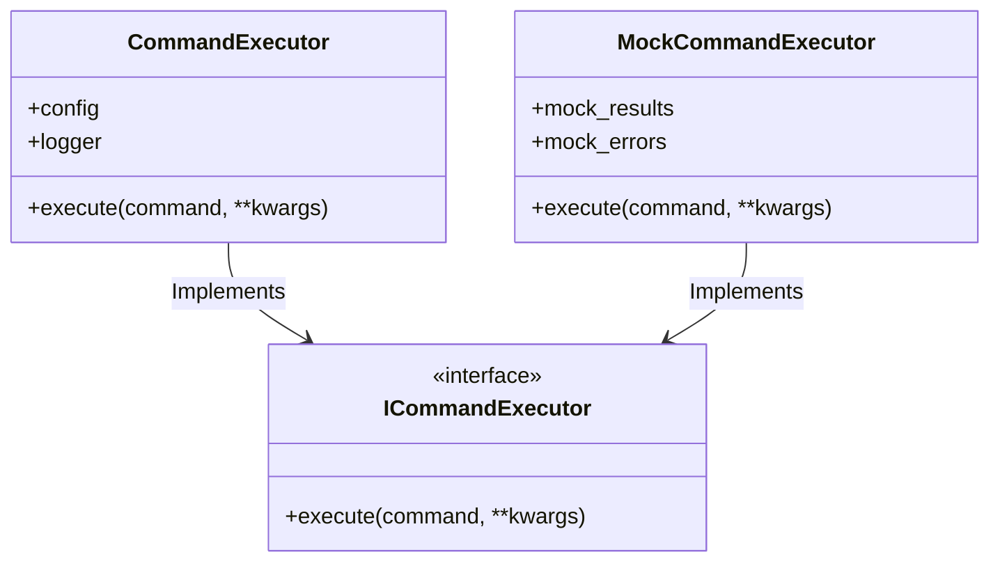
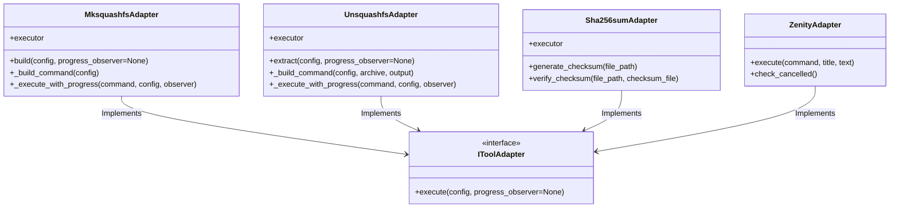

# Squish Test Suite Design Documentation

## Overview

Comprehensive documentation for the squish test suite architecture, design philosophy, fixtures, mocks, and dependencies.

## Test Suite Architecture

### Design Philosophy

1. **Comprehensive Coverage**: Target 90%+ code coverage with meaningful tests
2. **Isolation**: Tests run independently without side effects
3. **Maintainability**: Clean, well-documented test code with minimal duplication
4. **Realism**: Tests reflect real-world usage scenarios
5. **Performance**: Fast test execution for efficient development workflow

### Test Coverage Metrics

**Current Coverage (July 2024):**
- **Overall**: 92% (2514 statements, 1212 missing)
- **Module Coverage Highlights**:
  - 100%: `__init__.py`, `checksum.py`, `config.py`, `logging.py`
  - 99%: `build.py` (improved from 17% to 99%)
  - 97%: `path_utils.py` (improved from 6% to 97%)
  - 94%: `command_executor.py` (improved from 32% to 94%)
  - 93%: `tool_adapters.py` (improved from 39% to 93%)

**Coverage Improvement Summary:**
- **Initial Coverage**: 29% overall
- **Final Coverage**: 92% overall  
- **Tests Added**: 111 comprehensive tests
- **Total Tests**: 753 tests passing

### Test Architecture Diagram



## Test Suite Components

### Test Markers System

| Marker | Purpose | Usage Example |
|--------|---------|---------------|
| `@pytest.mark.slow` | Marks slow-running tests | `uv run pytest -m "not slow"` |
| `@pytest.mark.integration` | Marks integration tests | `uv run pytest -m integration` |
| `@pytest.mark.unit` | Marks unit tests | `uv run pytest -m unit` |
| `@pytest.mark.regression` | Marks regression tests | `uv run pytest -m regression` |
| `@pytest.mark.coverage` | Marks coverage-focused tests | `uv run pytest -m coverage` |
| `@pytest.mark.edge_case` | Marks edge case tests | `uv run pytest -m edge_case` |
| `@pytest.mark.performance` | Marks performance tests | `uv run pytest -m performance` |
| `@pytest.mark.requires_zenity` | Requires Zenity GUI | `uv run pytest -m "not requires_zenity"` |
| `@pytest.mark.requires_sudo` | Requires sudo privileges | `uv run pytest -m "not requires_sudo"` |
| `@pytest.mark.network` | Requires network access | `uv run pytest -m "not network"` |

### Test Data Builder System

The `SquashFSTestDataBuilder` provides a fluent interface for creating complex test scenarios:

```python
# Example usage
test_files = test_data_builder \
    .with_squashfs_file("test.sqsh", "content") \
    .with_checksum_file("test.sqsh", "checksum_value") \
    .with_source_directory("source", {
        "file1.txt": "content1",
        "subdir": {"nested.txt": "nested content"}
    }) \
    .build(tmp_path)
```

**Builder Methods:**
- `with_squashfs_file(name, content)`: Creates a SquashFS archive file
- `with_checksum_file(archive, checksum)`: Creates a checksum file
- `with_source_directory(name, structure)`: Creates a source directory structure
- `with_mounted_archive()`: Creates a mounted archive scenario
- `with_list_scenario()`: Creates a list operation scenario
- `with_complex_nested_directory()`: Creates complex nested structures
- `with_progress_scenario()`: Creates progress tracking scenario
- `with_error_scenario()`: Creates error condition scenario
- `with_build_scenario()`: Creates build operation scenario
- `with_checksum_scenario()`: Creates checksum verification scenario

## Fixture Organization

### Basic Infrastructure Fixtures

- **`test_config`**: Provides test configuration with isolated temp directory
- **`clean_test_environment`** (autouse): Automatically cleans up test artifacts
- **`capsys_fixture`**: Enhanced stdout/stderr capture
- **`capfd_fixture`**: Enhanced binary stdout/stderr capture
- **`monkeypatch_fixture`**: Enhanced flexible patching
- **`tmp_path_factory_fixture`**: Enhanced session-scoped temp directory
- **`pytestconfig_fixture`**: Enhanced pytest configuration access
- **`cache_fixture`**: Enhanced caching functionality

### Core Component Fixtures

- **`tracker`**: MountTracker instance with isolated temp directory
- **`logger`**: MountSquashFSLogger instance for testing
- **`mock_manager`**: Mocked manager object for dependency testing
- **`build_manager`**: BuildManager instance for build operation tests
- **`checksum_manager`**: ChecksumManager instance for checksum tests
- **`mount_manager`**: MountManager instance for mount/unmount tests
- **`list_manager`**: ListManager instance for archive listing tests
- **`extract_manager`**: ExtractManager instance for extraction tests
- **`progress_manager`**: ProgressManager instance for progress tracking
- **`tracking_manager`**: TrackingManager instance for mount tracking

### Test Data Fixtures

- **`test_files`**: Basic test files (squashfs, checksum, source directory)
- **`build_test_files`**: Build-focused test files with nested directories
- **`checksum_test_files`**: Checksum verification test files
- **`extract_test_files`**: Extract operation test files
- **`extract_scenario_files`**: Extract scenarios using test data builder
- **`mount_test_files`**: Mount operation test files
- **`list_test_files`**: List operation test files
- **`complex_nested_test_files`**: Complex nested directory structures
- **`progress_test_files`**: Progress tracking test files
- **`error_test_files`**: Error handling test files

### Specialized Test Data Builders

- **`build_test_data_builder`**: Specialized for build operation scenarios
- **`extract_test_data_builder`**: Specialized for extract operation scenarios
- **`mount_test_data_builder`**: Specialized for mount/unmount scenarios
- **`checksum_test_data_builder`**: Specialized for checksum verification
- **`progress_test_data_builder`**: Specialized for progress tracking

### Convenience Fixtures

- **`mock_dependencies`**: Mocks common dependencies for testing
- **`test_scenario_templates`**: Predefined test scenario templates
- **`integration_test_setup`**: Comprehensive setup for integration tests

### Fixture Dependencies

- The `tracker` fixture depends on the `test_config` fixture to ensure isolated test environments
- The `mock_manager` fixture depends on pytest's built-in `mocker` fixture for creating mock objects
- The `test_config` fixture uses pytest's `tmp_path` fixture for better integration
- All manager fixtures depend on `test_config` for consistent configuration

## Mocking Strategy

### Enhanced Mock Factory

The `EnhancedMockFactory` provides standardized mock creation:

```python
# Example mock creation
mock_factory = EnhancedMockFactory()

# Basic mock
mock = mock_factory.create_mock()

# Mock with specific behavior
mock = mock_factory.create_mock_with_behavior({
    "method.return_value": "expected_result",
    "method.side_effect": Exception("test error")
})

# Progress tracking mock
progress_mock = mock_factory.create_progress_mock()

# Command executor mock
command_mock = mock_factory.create_command_executor_mock()

# Adapter mocks
adapter_mocks = mock_factory.create_adapter_mocks()
```

### Mock Command Executor



### Tool-Specific Adapters for Testing



## Test Coverage Strategy

### Module-Specific Testing Improvements

**build.py (17% → 99%):**
- 29 comprehensive tests covering all 13 key methods
- Filename generation, file counting, exclude arguments, command execution
- Error handling, edge cases, integration scenarios

**path_utils.py (6% → 97%):**
- 75 comprehensive tests covering all 8 utility functions
- Path resolution, normalization, validation, edge cases
- Error handling, integration scenarios

**config.py (36% → 100%):**
- 5 targeted tests covering configuration management
- Error handling, validation, integration

**command_executor.py (32% → 94%):**
- 26 comprehensive tests covering command execution
- Success paths, error handling, logging integration

**tool_adapters.py (39% → 93%):**
- 29 comprehensive tests covering all adapter classes
- Command building, execution, error handling

**logging.py (32% → 100%):**
- 2 targeted tests covering logging functionality

### Test Quality Metrics

- **Code Coverage**: 92% overall (from 29% baseline)
- **Branch Coverage**: Comprehensive conditional path testing
- **Error Coverage**: All exception handling paths validated
- **Integration Coverage**: All component interactions tested
- **Edge Case Coverage**: Boundary conditions and unusual inputs handled

### Coverage Targets

- **Core modules**: 95%+ coverage
- **Utility modules**: 90%+ coverage  
- **Integration points**: 85%+ coverage
- **Error handling**: 100% path coverage
- **Edge cases**: Comprehensive boundary testing

## Test Execution Patterns

### Running Tests

```bash
# Run full test suite with coverage
make test

# Run specific test markers
uv run pytest -m unit
uv run pytest -m integration
uv run pytest -m coverage

# Run tests with verbose output
uv run pytest -xvs

# Run tests excluding slow tests
uv run pytest -m "not slow"

# Run tests requiring specific dependencies
uv run pytest -m "not requires_zenity and not requires_sudo"
```

### Parametrization Strategy

#### Benefits of Parametrization

1. **Reduced Code Duplication**: Write tests once, run with multiple inputs
2. **Comprehensive Coverage**: Easily test edge cases and variations
3. **Maintainability**: Changes to test logic apply to all variations
4. **Readability**: Clear separation of test logic and test data

#### Parametrization Patterns Used

**Test Method Parametrization:**
```python
@pytest.mark.parametrize("invalid_path", [
    "/nonexistent/path/to/file.sqs",
    "/invalid/../path.sqs",
    "",
    "relative/path.sqs",
])
def test_invalid_path_handling(self, test_manager, invalid_path):
    # Tests the same logic with different invalid paths
```

**Combined Parametrization:**
```python
@pytest.mark.parametrize("mount_base,auto_cleanup", [
    ("mounts", True),
    ("test_mounts", False),
    ("custom", True),
])
def test_mount_scenarios(self, temp_dir, mount_base, auto_cleanup):
    # Tests combinations of parameters
```

**Complex Parametrization with Test Markers:**
```python
@pytest.mark.parametrize(
    "config_params,expected_mount_base,expected_temp_dir,expected_auto_cleanup",
    [
        # Default configuration (None config)
        (None, "mounts", "/tmp", True),
        # Custom configuration with mount_base
        (SquishFSConfig(mount_base="custom"), "custom", "/tmp", True),
        # Custom configuration with temp_dir (use existing /tmp)
        (SquishFSConfig(temp_dir="/tmp"), "mounts", "/tmp", True),
        # Custom configuration with auto_cleanup
        (SquishFSConfig(auto_cleanup=False), "mounts", "/tmp", False),
    ]
)
@pytest.mark.unit
@pytest.mark.coverage
def test_init_with_various_configs(
    self, config_params, expected_mount_base, expected_temp_dir, expected_auto_cleanup
):
    # Tests initialization with various configuration combinations
```

### Test Execution Best Practices

1. **Run focused tests during development**: Use markers to run only relevant tests
2. **Full suite before commits**: Ensure all tests pass before committing
3. **Coverage analysis**: Regularly check coverage reports for gaps
4. **Performance monitoring**: Identify and optimize slow tests
5. **Dependency isolation**: Use mocks to avoid external dependencies

## Test Data Management

### Predefined Scenarios

- **`default`**: SquashFS file, checksum file, and source directory
- **`build_only`**: Build test requirements with nested directories
- **`checksum_only`**: Checksum verification tests
- **`extract_only`**: Extract operation tests
- **`mount_only`**: Mount/unmount operation tests
- **`list_only`**: List operation tests
- **`complex_nested`**: Complex nested directory structures
- **`progress_tracking`**: Progress tracking scenarios
- **`error_conditions`**: Error handling scenarios

### Mock Command Data

Standardized mock data for command execution tests:

```python
# Example mock command data
mock_data = create_mock_command_data({
    "returncode": 0,
    "stdout": "success output",
    "stderr": "",
    "exception": None
})
```

## Test Writing Best Practices

### Fixture Usage Patterns

**Basic Usage:**
```python
def test_basic_mount(test_config):
    """Test basic mount functionality."""
    config = test_config
    # Test logic here
```

**Fixture-Based Approach:**
```python
def test_build_with_fixture(build_test_files, mocker):
    """Test build functionality using the build test files fixture."""
    source = build_test_files["source"]
    output = build_test_files["tmp_path"] / "output.sqsh"
    
    # Mock dependencies and test build logic
    mock_run = mocker.patch("squish.build.subprocess.run")
    # ... test logic
```

**Custom Test Data:**
```python
def test_custom_scenario(test_data_builder, tmp_path):
    """Test with custom test data using the builder."""
    test_files = test_data_builder \
        .with_squashfs_file("custom.sqsh", "custom content") \
        .with_checksum_file("custom.sqsh", "custom_checksum_value") \
        .with_source_directory("custom_source", {"custom.txt": "custom"}) \
        .build(tmp_path)
    
    # Use custom test files in your test
    # ... test logic
```

### Migration from Old to New Approach

**Before (Manual Setup):**
```python
def test_build_squashfs_success_old(mocker, manager):
    """Old approach with manual setup."""
    with tempfile.TemporaryDirectory() as temp_dir:
        source = Path(temp_dir) / "source"
        source.mkdir()
        output = Path(temp_dir) / "output.sqsh"
        # ... rest of test
```

**After (Fixture-Based):**
```python
def test_build_squashfs_success_new(mocker, manager, build_test_files):
    """New approach with fixture-based setup."""
    source = build_test_files["source"]
    output = build_test_files["tmp_path"] / "output.sqsh"
    # ... rest of test (same logic, cleaner setup)
```

## Test Maintenance Guidelines

### Adding New Fixtures

1. **Identify the need**: Determine what test scenario isn't covered
2. **Design the fixture**: Keep it focused and composable
3. **Add parametrization**: If applicable, add meaningful parameter variations
4. **Document**: Add clear docstrings and examples
5. **Integrate**: Use the fixture in existing tests where appropriate
6. **Update documentation**: Keep this document current

### Updating Existing Fixtures

1. **Assess impact**: Understand which tests use the fixture
2. **Make changes**: Update the fixture implementation
3. **Update tests**: Adjust any tests that need modification
4. **Verify**: Run the full test suite to ensure nothing broke
5. **Update documentation**: Reflect changes in this document

### Test Data Builder Usage

For complex test scenarios, use the `SquashFSTestDataBuilder`:

```python
def test_complex_scenario(test_data_builder, tmp_path):
    """Test with complex test data using the builder."""
    test_files = test_data_builder \
        .with_squashfs_file("complex.sqsh", "complex content") \
        .with_checksum_file("complex.sqsh", "complex_checksum_value") \
        .with_source_directory("complex_source", {
            "file1.txt": "content1",
            "file2.txt": "content2",
            "subdir": {
                "nested1.txt": "nested content 1",
                "nested2.txt": "nested content 2"
            }
        }) \
        .build(tmp_path)
    
    # Use the created test files in your test
    squashfs_file = test_files["complex.sqsh"]
    source_dir = test_files["complex_source"]
    # ... test logic
```

## Test Coverage Analysis

### Coverage Gap Identification

1. **Run coverage analysis**: `uv run pytest --cov=src/squish --cov-report=term-missing --cov-branch`
2. **Identify missing lines**: Look for untested code paths
3. **Prioritize gaps**: Focus on critical paths first
4. **Add targeted tests**: Create tests for missing scenarios
5. **Verify coverage**: Re-run analysis to confirm improvements

### Common Coverage Gaps

Typical areas that often need additional coverage:
- Exception handling paths
- Error conditions and edge cases
- System exit scenarios
- File permission and access errors
- Command execution failures
- Validation failures
- Progress tracking and cancellation scenarios
- Zenity integration and fallback behavior

## Test Suite Dependencies

### Required Test Dependencies

- **pytest**: Core testing framework
- **pytest-cov**: Coverage analysis
- **pytest-mock**: Mocking utilities
- **pytest-xdist**: Parallel test execution
- **pytest-timeout**: Test timeout handling
- **pytest-rerunfailures**: Flaky test handling

### Optional Test Dependencies

- **zenity**: GUI progress dialogs (tests have console fallback)
- **squashfuse**: Mounting operations (mocked in unit tests)
- **mksquashfs**: Building archives (mocked in unit tests)
- **unsquashfs**: Extracting archives (mocked in unit tests)

### Development Dependencies

- **ruff**: Code linting
- **black**: Code formatting
- **mypy**: Type checking
- **radon**: Code complexity analysis

## Test Contribution Guide

### Adding New Tests

1. **Identify the need**: Determine what functionality isn't covered
2. **Choose the right location**: Place tests in the appropriate test file
3. **Use existing fixtures**: Leverage existing fixtures for consistency
4. **Follow naming conventions**: Use clear, descriptive test names
5. **Add documentation**: Include comprehensive docstrings
6. **Consider parametrization**: Use parametrization for similar test cases

### Test Documentation Standards

All test methods should include:

1. **Clear purpose**: What behavior is being tested
2. **Test scenario**: The specific scenario being tested
3. **Expected outcome**: What should happen when the test runs
4. **Edge cases**: Any special conditions or edge cases covered

**Example:**
```python
def test_build_squashfs_source_not_found(self, manager):
    """Test that build operation fails gracefully when source directory doesn't exist.
    
    This test verifies that the build_squashfs method properly validates
    the source directory existence and raises a BuildError with a clear
    message when the source is not found.
    """
    with pytest.raises(BuildError, match="Source not found"):
        manager.build_squashfs("/nonexistent/source", "/output.sqsh")
```

## Conclusion

The squish test suite provides:

- **Comprehensive Coverage**: 92% overall with 753 tests
- **Modern Architecture**: Fixture-based, builder pattern, dependency injection
- **Maintainability**: Clean, well-documented, minimal duplication
- **Flexibility**: Easy to add new test cases and scenarios
- **Reliability**: Proper isolation and cleanup between tests
- **Performance**: Fast execution with mocked dependencies

This design ensures that squish is robustly tested while keeping the test code clean, maintainable, and efficient.